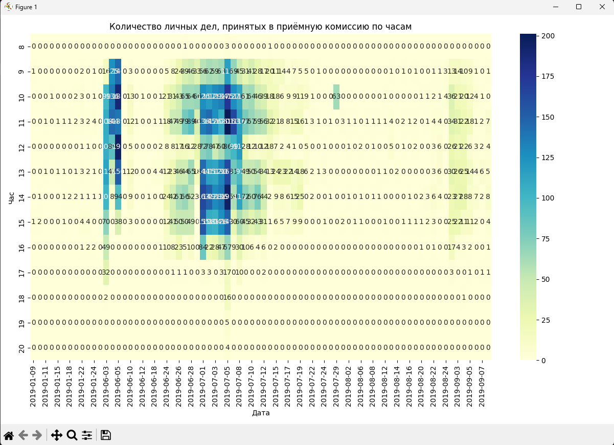

# Финальный проект

Преобразовывает данные из файла data__1_.csv

Строит графическое представление данных в виде heatmap из библиотеки SeaBorn

## Запуск программы

`pip install -r requirements.txt`
